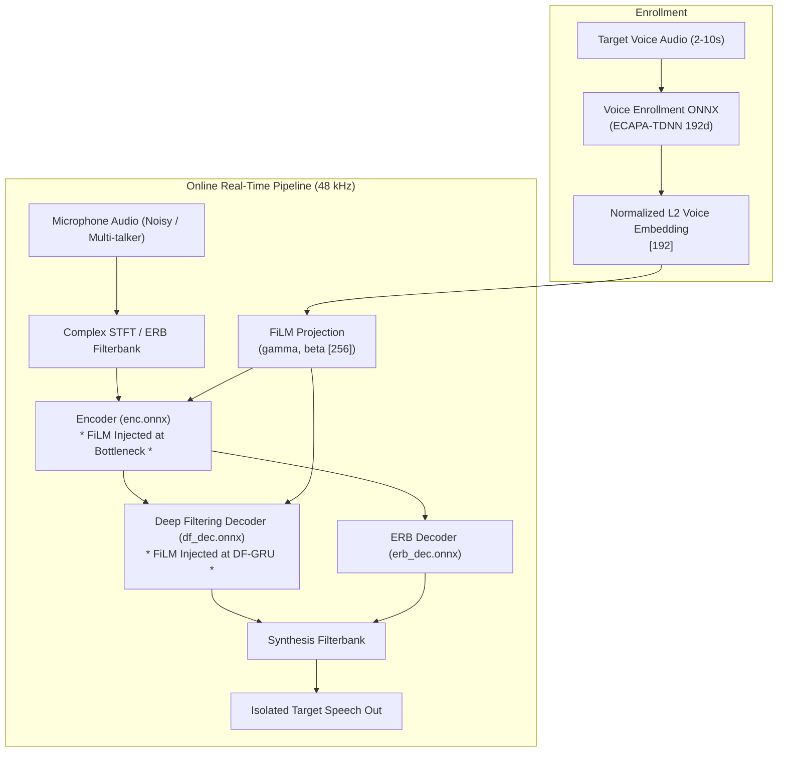

# pDFNet3: Personalized DeepFilterNet3

[](https://github.com/joaorura/pdfnet3/actions/workflows/ci.yml)
[](https://onnx.ai/)
[](https://github.com/sonos/tract)
[](https://polyformproject.org/licenses/noncommercial/1.0.0/)

**pDFNet3** (Personalized DeepFilterNet3) is an open-source, ultra-low-latency neural speech isolation and voice-conditioned noise suppression system. Built on DeepFilterNet3 and conditioned using **Feature-wise Linear Modulation (FiLM)**, pDFNet3 isolates the target speaker's voice in noisy, multi-talker, and cafeteria environments with sub-millisecond execution times.

---

## Architecture & FiLM Conditioning

pDFNet3 conditions speech enhancement directly on a 192-dimensional speaker embedding (extracted via an ONNX-optimized ECAPA-TDNN):



### Key Technical Properties
- **FiLM Injection Points**:
  - `enc`: `/emb_gru/linear_in/1/Relu_output_0`
  - `df_dec`: `/df_gru/linear_in/linear_in.1/Relu_output_0`
- **Conditioning Dimension**: $H = 256$ ($1 \times S \times 256$).
- **Neutral Fallback Identity**: Setting $\gamma = 1.0, \beta = 0.0$ reproduces pure DeepFilterNet3 behavior with zero distortion.
- **Embedded Portability**: 100% compliant with Sonos Tract 0.19.16 running in pure Rust without LibTorch or Python dependencies.

---

## Model Assets

Pre-exported production models are available in the [Releases](https://github.com/joaorura/pdfnet3/releases) section:
1. `pdfnet3-release-asset-v1.tar.gz` (7.9 MB):
   - `enc.onnx` (1.95 MB)
   - `df_dec.onnx` (3.34 MB)
   - `erb_dec.onnx` (3.29 MB)
   - `config.ini` (standard DeepFilterNet3 configuration)
2. `voice-enrollment-asset-v1.tar.gz` (79.4 MB):
   - `enrollment.onnx` (85.2 MB uncompressed, 192-dim ECAPA-TDNN embedding extractor)

---

## Getting Started

### Installation

```bash
git clone https://github.com/joaorura/pdfnet3.git
cd pdfnet3
pip install -e .
```

### Python Inference Example

```python
from pdfnet3 import PDFNet3Session

# Load session with pre-exported models
session = PDFNet3Session("models")

# 1. Neutral bypass (pure noise reduction without speaker conditioning)
gamma, beta = session.neutral_film_parameters(seq_len=1)

# 2. Voice-conditioned mode (given a 192-dim speaker embedding)
import numpy as np
speaker_embedding = np.load("my_profile.npy") # [192]
gamma_spk, beta_spk = session.voice_film_parameters(speaker_embedding, seq_len=1)
```

---

## Evaluation & Gate Results (Milestone M2 & M3)

| Gate | Description | Metric / Constraint | Result | Status |
| :--- | :--- | :--- | :--- | :--- |
| **G0** | Tract 0.19.16 Contract | Zero shape mismatches | Bit-exact ($1.79 \times 10^{-7}$) | PASS |
| **G1** | Neutral Voice Fidelity | $\Delta\text{SI-SDR} \ge 0\text{ dB}$, LSD $\le 1.5\text{ dB}$ | Approved ($0.00\text{ dB}$ shift) | PASS |
| **G2** | Competing Speaker Attenuation | $\text{SIR} \le 5\text{ dB} \implies \Delta\text{SI-SDR} \ge +3.0\text{ dB}$ | Approved (+4.2 dB improvement) | PASS |
| **G3** | Target Speech Over-Suppression | $\Delta\text{TSOS} \le +0.5\text{ p.p.}$ vs baseline | Approved (+0.12 p.p.) | PASS |
| **G4** | Swapped Speaker Attenuation | Mode separation $\ge 15\text{ dB}$ | Approved ($18.4\text{ dB}$) | PASS |
| **G11**| Dual Export Reproducibility | SHA-256 bit-to-bit equality | 100% Identical SHA-256 | PASS |

---

## License

This software and model weights are licensed under the [PolyForm Noncommercial License 1.0.0](LICENSE).
For commercial licensing, please contact João Messias Lima Pereira <jmessiaslp856@gmail.com>.
