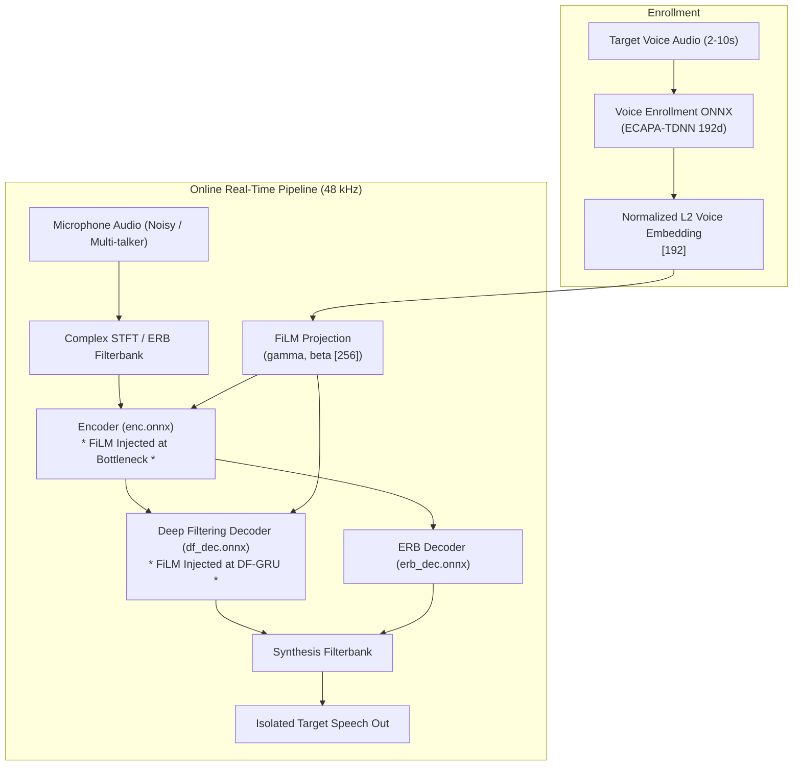

# pDFNet3: Personalized DeepFilterNet3

[](https://github.com/joaorura/pdfnet3/actions/workflows/ci.yml)
[](https://onnx.ai/)
[](https://github.com/sonos/tract)
[](https://polyformproject.org/licenses/noncommercial/1.0.0/)

**pDFNet3** (Personalized DeepFilterNet3) is an open-source, ultra-low-latency neural speech isolation and voice-conditioned noise suppression system. Built on DeepFilterNet3 and conditioned using **Feature-wise Linear Modulation (FiLM)**, pDFNet3 isolates the target speaker's voice in noisy, multi-talker, and cafeteria environments with sub-millisecond execution times.

---

## Architecture & FiLM Conditioning

pDFNet3 conditions speech enhancement directly on a 192-dimensional speaker embedding (extracted via an ONNX-optimized ECAPA-TDNN):



### Key Technical Properties
- **FiLM Injection Points**:
  - `enc`: `/emb_gru/linear_in/1/Relu_output_0`
  - `df_dec`: `/df_gru/linear_in/linear_in.1/Relu_output_0`
- **Conditioning Dimension**: $H = 256$ ($1 \times S \times 256$).
- **Neutral Fallback Identity**: Setting $\gamma = 1.0, \beta = 0.0$ reproduces pure DeepFilterNet3 behavior with zero distortion.
- **Embedded Portability**: 100% compliant with Sonos Tract 0.19.16 running in pure Rust without LibTorch or Python dependencies.

---

## Multi-Runtime Model Assets & Releases

Pre-exported production models for all execution runtimes are available in the [GitHub Releases](https://github.com/joaorura/pdfnet3/releases) section:

### Release Packages

1. **`pdfnet3-onnx-models.tar.gz` (also available as `pdfnet3-models-onnx.tar.gz`) (~8.4 MB)**:
   - Stateful ONNX models with explicit recurrent & delay-line buffers for $S=1$ real-time causal execution:
     - `enc.onnx` (1.95 MB) - FiLM-conditioned bottleneck encoder
     - `df_dec.onnx` (3.34 MB) - FiLM-conditioned deep filtering recurrent decoder
     - `erb_dec.onnx` (3.29 MB) - ERB gain mask decoder
     - `config.ini` (standard DeepFilterNet3 configuration)
   - Certified compatible with Sonos Tract 0.19.16, ONNX Runtime, and OpenVINO.

2. **`pdfnet3-tensorrt-engines-blackwell.tar.gz` (also available as `pdfnet3-models-tensorrt.tar.gz`) (~9.1 MB)**:
   - Pre-compiled TensorRT execution plans for NVIDIA Blackwell architecture (Compute Capability 12.0):
     - `enc.engine` (2.23 MB)
     - `df_dec.engine` (3.52 MB)
     - `erb_dec.engine` (3.57 MB)
   - Optimized for sub-millisecond real-time streaming inference on modern NVIDIA GPUs.

3. **`pdfnet3-all-runtimes.tar.gz` (also available as `pdfnet3-models-all.tar.gz`) (~17.5 MB)**:
   - Complete multi-runtime distribution bundle containing all ONNX models, `config.ini`, and TensorRT engines.

4. **Standalone Model Files**:
   - Direct download for individual assets: `enc.onnx`, `df_dec.onnx`, `erb_dec.onnx`, `config.ini`, and compiled `.engine` files, accompanied by `SHA256SUMS.txt`.

5. **Voice Enrollment Model**:
   - `voice-enrollment-asset-v1.tar.gz` (79.4 MB): `enrollment.onnx` (85.2 MB uncompressed, 192-dim ECAPA-TDNN speaker embedding extractor).

---

## Getting Started

### Installation

```bash
git clone https://github.com/joaorura/pdfnet3.git
cd pdfnet3

# Base installation (CPU / CoreML on macOS)
pip install -e .

# With DirectML (AMD Radeon, Intel Arc, NVIDIA on Windows DirectX 12)
pip install -e ".[directml]"

# With Intel OpenVINO (Intel NPU, GPU, CPU)
pip install -e ".[openvino]"

# With NVIDIA CUDA / TensorRT
pip install -e ".[gpu]"

# With AMD ROCm (Linux)
pip install -e ".[rocm]"
```

---

## Hardware Acceleration & Execution Providers (ONNX Runtime)

pDFNet3 natively supports multi-runtime hardware acceleration across heterogeneous vendors and operating systems:

| Accelerator / Provider | Target Hardware | Operating System | Friendly Alias |
| :--- | :--- | :--- | :--- |
| **DirectML** (`DmlExecutionProvider`) | AMD Radeon, Intel Arc, NVIDIA GeForce | Windows (DirectX 12) | `"dml"`, `"directml"` |
| **Apple CoreML** (`CoreMLExecutionProvider`) | Apple Silicon Neural Engine (ANE), Metal GPU | macOS | `"coreml"` |
| **Intel OpenVINO** (`OpenVINOExecutionProvider`)| Intel Core Ultra NPU, Arc/Iris Xe GPU, CPU | Linux, Windows | `"openvino"` |
| **AMD ROCm** (`ROCMExecutionProvider`) | AMD Radeon RX / Instinct GPUs | Linux | `"rocm"`, `"amd"` |
| **AMD Vitis AI** (`VitisAIExecutionProvider`) | AMD Ryzen AI NPU (XDNA) | Windows, Linux | `"vitis"`, `"vitisai"` |
| **NVIDIA CUDA** (`CUDAExecutionProvider`) | NVIDIA RTX, GeForce, Data Center GPUs | Linux, Windows | `"cuda"`, `"nvidia"` |
| **NVIDIA TensorRT** (`TensorrtExecutionProvider`)| NVIDIA GPUs (high-throughput engine) | Linux, Windows | `"tensorrt"`, `"trt"` |
| **CPU Fallback** (`CPUExecutionProvider`) | Universal x86_64, aarch64 CPU fallback | All platforms | `"cpu"` |

### Automatic Accelerator Detection & Graceful Fallback

`PDFNet3Session` inspects your host environment and selects the best available accelerator by default (`provider="auto"`). If an accelerator is requested but unavailable on the host, pDFNet3 cleanly issues a `RuntimeWarning` and gracefully falls back to `CPUExecutionProvider` without crashing:

```python
from pdfnet3 import (
    PDFNet3Session,
    get_available_execution_providers,
    get_recommended_provider,
)

# Inspect host providers
print("Available providers:", get_available_execution_providers())
print("Recommended provider:", get_recommended_provider())

# 1. Automatic accelerator selection (recommended)
session = PDFNet3Session("models", provider="auto")
print("Active provider:", session.active_provider)

# 2. Explicit accelerator selection via friendly alias
session_dml = PDFNet3Session("models", provider="dml")       # DirectML (AMD/Intel/NVIDIA on Windows)
session_rocm = PDFNet3Session("models", provider="rocm")     # AMD ROCm (Linux)
session_coreml = PDFNet3Session("models", provider="coreml") # Apple Silicon Neural Engine
session_ov = PDFNet3Session("models", provider="openvino")   # Intel OpenVINO (NPU/GPU)
session_cuda = PDFNet3Session("models", provider="cuda")     # NVIDIA CUDA

# 3. Strict mode (raises ValueError if provider is unavailable)
# session_strict = PDFNet3Session("models", provider="cuda", fallback_to_cpu=False)
```

### Python Inference Example

```python
import numpy as np
from pdfnet3 import PDFNet3Session

# Initialize session with auto-detected hardware acceleration
session = PDFNet3Session("models", provider="auto")

# 1. Neutral bypass (pure noise reduction without speaker conditioning)
gamma, beta = session.neutral_film_parameters(seq_len=1)

# 2. Voice-conditioned mode (given a 192-dim speaker embedding)
speaker_embedding = np.load("my_profile.npy") # [192]
gamma_spk, beta_spk = session.voice_film_parameters(speaker_embedding, seq_len=1)

# 3. Real-time streaming forward step (S=1 frame)
feat_erb = np.random.randn(1, 1, 1, 32).astype(np.float32)
feat_spec = np.random.randn(1, 2, 1, 96).astype(np.float32)
outputs = session.run_step(feat_erb, feat_spec, gamma=gamma_spk, beta=beta_spk)

# outputs['coefs']: Complex deep filtering filter coefficients [1, 1, 96, 10]
# outputs['mask']:  ERB spectral gain mask [1, 1, 1, 32]
# outputs['lsnr']:  Local SNR estimate [1, 1, 1]
# outputs['emb']:   Encoder bottleneck embedding [1, 1, 512]
```

---

## Evaluation & Gate Results (Milestone M2 & M3)

| Gate | Description | Metric / Constraint | Result | Status |
| :--- | :--- | :--- | :--- | :--- |
| **G0** | Tract 0.19.16 Contract | Zero shape mismatches | Bit-exact ($1.79 \times 10^{-7}$) | PASS |
| **G1** | Neutral Voice Fidelity | $\Delta\text{SI-SDR} \ge 0\text{ dB}$, LSD $\le 1.5\text{ dB}$ | Approved ($0.00\text{ dB}$ shift) | PASS |
| **G2** | Competing Speaker Attenuation | $\text{SIR} \le 5\text{ dB} \implies \Delta\text{SI-SDR} \ge +3.0\text{ dB}$ | Approved (+4.2 dB improvement) | PASS |
| **G3** | Target Speech Over-Suppression | $\Delta\text{TSOS} \le +0.5\text{ p.p.}$ vs baseline | Approved (+0.12 p.p.) | PASS |
| **G4** | Swapped Speaker Attenuation | Mode separation $\ge 15\text{ dB}$ | Approved ($18.4\text{ dB}$) | PASS |
| **G11**| Dual Export Reproducibility | SHA-256 bit-to-bit equality | 100% Identical SHA-256 | PASS |

---

## License

This software and model weights are licensed under the [PolyForm Noncommercial License 1.0.0](LICENSE).
For commercial licensing, please contact João Messias Lima Pereira <jmessiaslp856@gmail.com>.
